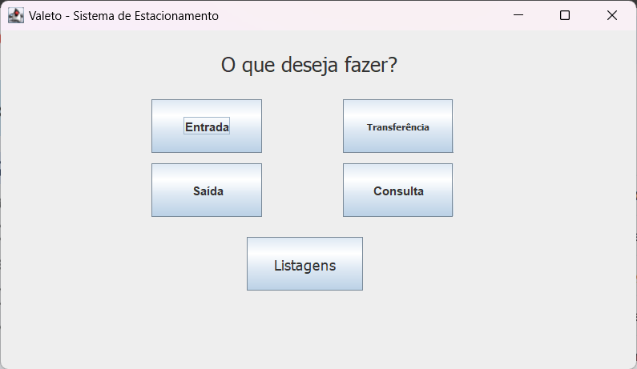

# :car: Valeto
Este projeto consiste em um sistema de gestão de estacionamento com as seguintes funcionalidades:

## Componentes do sistema

- Classe **Valetinho** - interface gráfica (GUI) / frontend;
- Classe **Estacionamento** - console / backend;
- Pasta **data** para armazenamento de dados;
- Classes de testes.

## :bust_in_silhouette: Contribuidores
- Allan Amâncio -> https://github.com/AllanSmithll
- Márcio José -> https://github.com/ImMarcio
- Yuri Sousa -> https://github.com/Souza1999

## :rocket: Começando
Estas instruções te ajudarão a obter uma cópia do projeto em sua máquina local para fins de desenvolvimento e testes.

## Pré-requisitos
Para rodar este projeto, você precisa ter os seguintes softwares instalados na sua máquina:

- Java Development Kit (JDK) 17 ou superior
- IDE Java

## Instalação
Siga os passos abaixo para obter uma cópia local do projeto:

1. Clone ou baixe este repositório para sua máquina local.
2. Abra a IDE.
3. Clique em **File > Open Projects from File System**.
4. Clique em **Directory** e navegue até o diretório onde você clonou ou baixou este repositório.
5. Selecione o projeto e clique em **Finish**.

## Execução
Para rodar o projeto, siga os passos abaixo:

1. Abra a classe **Valetinho** localizada na pasta `src`.
2. Clique no botão **Run** ou pressione **Ctrl + F11** para executar a aplicação.

## :white_check_mark: Executando os testes
Para rodar os testes, siga os passos abaixo:

1. Abra as classes de teste localizadas na pasta `src/test`.
2. Clique no botão **Run** ou pressione **Ctrl + F11** para executar os testes.

## :file_folder: Armazenamento de dados
Todos os dados são armazenados na pasta **data** localizada no diretório raiz do projeto.

## :memo: Licença
Este projeto está licenciado sob a Licença MIT - veja o arquivo LICENSE.md para mais detalhes.

## :question: Precisa de ajuda?
Se precisar de ajuda com o projeto ou tiver alguma dúvida, entre em contato com os contribuidores mencionados na seção Contribuidores.
